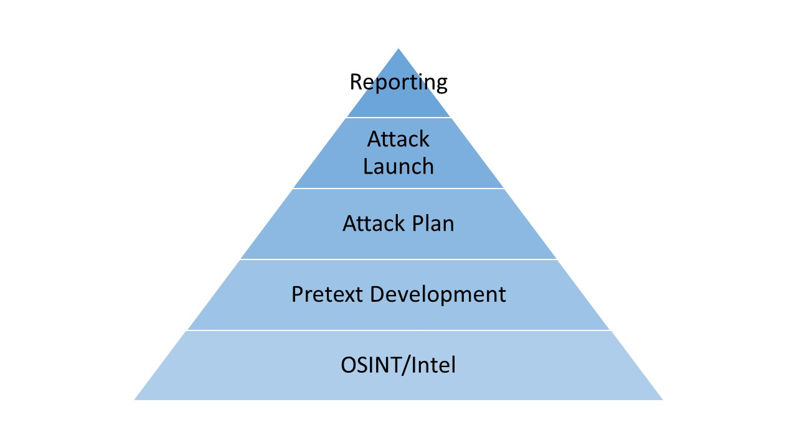

# Social Engineering

- [Principes](#principes)
  - [La pyramide du Social Engineering](#la-pyramide-du-social-engineering)
- [OSINT (Open Source Intelligence)](#osint-open-source-intelligence)
  - [Non-Technical OSINT](#non-technical-osint)
  - [Technical OSINT](#technical-osint)
    - [Google Dork](#google-dork)
- [Communication](#communication)
- [Cours ENSIBS](#cours-ensibs)
- [Tools](#tools)

> [Social Engineering: The Science of Human Hacking, 2nd Edition](https://www.chasse-aux-livres.fr/prix/111943338X/social-engineering-hadnagy), Christopher Hadnagy.

## Principes

Christopher Hadnagy définit l'ingénierie sociale comme *tout acte qui influence une personne à faire une action, qui pourrait ou ne pas être, dans son intérêt*.

Les utilisations mal intentionnées de l'ingénierie sociale peuvent être classées en 3 vecteurs d'attaque :
- Texte : Interaction minimale, comprend le [phishing](https://en.wikipedia.org/wiki/Phishing) et leurs variantes.
- Voix : Interaction en temps réel avec la cible. Il faut pouvoir s'adapter à l'interlocuteur
- Impersonation : l'attaquant se fait passer physiquement pour quelqu'un qu'il n'est pas. Requiert le plus de compétence, de moyens (humains/financiers), et de préparation.

L'être humain est un être vivant social, et c'est dans notre instinct d'aider notre semblable.

L'ingénierie social tire profit du fait qu'il existe dans la société des biais

### La pyramide du Social Engineering

Cette représentation permet de comprendre l'ordre et l'importance des différentes étape de la réalisation d'une attaque, sous l'angle d'un professionel dont le but est de faire réaliser au client ses vulnérabilités, et lui permettre de comprendre ce qui peut être amélioré, pour mieux se protéger.

1. La recherche en source ouverte
2. Le pretexte
3. L'éxécution

## OSINT (Open Source Intelligence)

### Non-Technical OSINT

### Technical OSINT

https://www.lemondeinformatique.fr/actualites/lire-8-outils-osint-pour-le-cyber-renseignement-80484.html

Outils :
- Moteur de recherche des fuites d'information : https://intelx.io/
- Moteur de recherche de l'internet des objets : https://www.shodan.io/

#### Google Dork

https://www.sans.org/security-resources/GoogleCheatSheet.pdf

## Communication

## Cours ENSIBS

L'habit fait le moine

Notre cerveau a évolué en s'adaptant à un monde (environnement, société) qui existe depuis des centaines de milliers d'année, en très peu de temps, ce monde a changé, et notre cerveau est resté le même.

## Tools

https://www.social-engineer.org/framework/

theHarvester
