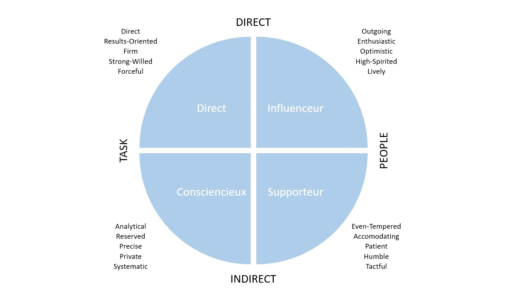

# Social Engineering

- [Introduction](#introduction)
- [La pyramide du Social Engineering](#la-pyramide-du-social-engineering)
- [1. OSINT (Open Source Intelligence)](#1-osint-open-source-intelligence)
  - [Non-Technical OSINT](#non-technical-osint)
  - [Technical OSINT](#technical-osint)
- [2. Développement du prétexte](#2-développement-du-prétexte)
  - [L'approche](#lapproche)
  - [Le modèle DISC](#le-modèle-disc)
- [3. Plan d'attaque](#3-plan-dattaque)
- [4. Lancement de l'attaque](#4-lancement-de-lattaque)
- [5. Compte rendu](#5-compte-rendu)
- [Se protéger](#se-protéger)

---

> [*Social Engineering: The Science of Human Hacking, 2nd Edition*](https://www.chasse-aux-livres.fr/prix/111943338X/social-engineering-hadnagy), Christopher Hadnagy

> [*Penser en algorithmes*](https://www.chasse-aux-livres.fr/prix/2889152553/penser-en-algorithmes-tom-griffiths), Tom Griffiths, Brian Christian

## Introduction

Christopher Hadnagy définit l'ingénierie sociale comme ***tout acte qui influence une personne à faire une action, qui pourrait, ou ne pas être, dans son intérêt***.

Avec cette définition, on comprend que la finalité de l'ingénierie sociale dépend de l'intention de la personne qui l'utilise.

L'ingénierie sociale consiste à utiliser les mécanismes humains et leurs limites pour influencer la prise de décision d'un individu. Les applications sont nombreuses : escroquerie, marketing, séduction, politique, renseignement, etc.

*Je pense qu'on se fait avoir parce que notre cerveau est héritée de [millions d'années d'évolution](https://en.wikipedia.org/wiki/History_of_life). 
Pendant longtemps, il était vital de décider rapidement, sur la base de peu d'informations. 
Ces préjugés sont [encore indispensables](https://fr.wikipedia.org/wiki/Préjugé#Nécessité) de nos jours, 
Mais ils peuvent maintenant nous jouer des tours. 
En quelques milliers d'années, nos civilisations ont évoluées [extrêmement rapidement](https://www.youtube.com/watch?v=yNLdblFQqsw), 
Alors que notre cerveau évolue, sur [une autre échelle de temps](https://en.wikipedia.org/wiki/Geologic_time_scale).*

Ainsi, un bon attaquant tirera profit de la multitude de [biais cognitifs](https://fr.wikipedia.org/wiki/Biais_cognitif) auxquels nous sommes sujet :

> cliquez sur l'image pour voir la carte interactive

Nous aurions [deux modes de pensée](https://fr.wikipedia.org/wiki/Système_1_/_Système_2_:_Les_deux_vitesses_de_la_pensée#Deux_systèmes_de_pensée), tout l'enjeu pour l'attaquant est de nous faire rester dans le système 1, en exploitant nos biais cognitifs, pour que nous agissions sans remise en question.

L'ingénierie sociale tire aussi partie d'une propriété de l'être humain : **nous sommes des êtres vivants sociaux**, et c'est dans notre instinct d'aider notre semblable lorsqu'il nous sollicite. C'est ~~pour l'argent~~ par empathie qu'on vient en aide au [prince nigérian](https://www.franceculture.fr/histoire/avant-les-mails-de-princes-nigerians-au-xviiieme-siecle-larnaque-aux-lettres-de-jerusalem).

## La pyramide du Social Engineering

Cette représentation permet de comprendre l'ordre et l'importance des différentes étape de la réalisation d'une attaque, sous l'angle d'un professionel dont le but est de faire comprendre au client ses vulnérabilités, et lui permettre de s'améliorer, pour mieux se protéger.

1. OSINT (Open Source Intelligence)
2. Développement du prétexte
3. Plan d'attaque
4. Lancement de l'attaque
5. Compte rendu

## 1. OSINT (Open Source Intelligence)

L'OSINT, pour Open Source Intelligence, consiste à se renseigner sur une personne/entreprise, à partir d'informations disponibles publiquement. C'est la **partie essentielle** de l'ingénierie sociale, sur laquelle l'attaquant passe le plus de temps. Il existe des moyens techniques de récolter ces informations (recherche google), et non techniques (discussion, observation). Pour l'attaquant il convient de bien documenter ses recherches, pour mieux les exploiter plus tard.

### Non-Technical OSINT

Par l'**observation**, un attaquant peut obtenir des informations utiles :
- Vêtements : y'a-t-il un code vestimentaire ?
- Points d'entrée et de sortie du lieu : y'a-t-il une porte utilisée par les salariés pour leurs pauses ?
- Conditions d'entrée : y'a-t-il un portique, un contrôle ?
- Sécurité du périmètre : y'a-t-il des caméras ?
- Personnel de sécurité : Combien de personnes ? Sont-il attentifs ?
- Equipements : y'a-t-il un ordinateur sur lequel faire du [shoulder surfing](https://fr.wikipedia.org/wiki/Shoulder_surfing) ?

### Technical OSINT

Outils :
- Moteur de recherche de l'Internet des objets : https://www.shodan.io/
- Moteur de recherche des fuites d'information : https://intelx.io/about
- Pour s'entraîner au GEOINT : https://www.geoguessr.com/
- Google Dork : https://www.sans.org/security-resources/GoogleCheatSheet.pdf
- Maltego
- Recon-ng
- theHarvester
- SpiderFoot
- `robot.txt` des sites
- Métadonnées des fichiers

Trafic en temps réel :
- Transport aérien : https://www.flightradar24.com/
- Transport maritime : https://www.vesselfinder.com/

Acronymes :
- https://www.acronymfinder.com/
- https://acronyms.thefreedictionary.com/

Base de connaissances :
- https://www.social-engineer.org/framework/
- https://osintframework.com/
- https://github.com/jivoi/awesome-osint

## 2. Développement du prétexte

Cette partie consiste à trouver une raison valable de rentrer en contact avec la cible. Partie cruciale qui peut grandement faciliter la tâche de l'attaquant s'il s'est bien renseigné. C'est aussi ici que l'attaquant détermine s'il aura besoin d'équipements, car bien équipé, [on peut entrer presque partout](https://www.youtube.com/watch?v=GyvRamX1VyA).

En fonction de ses compétences, et du niveau d'accès qu'il veut obtenir, l'attaquant utilisera des moyens plus ou moins avancés pour parvenir à ses fins.

Ainsi, les utilisations mal intentionnées de l'ingénierie sociale peuvent être classées en 3 vecteurs d'attaque :
- **Texte** : Interaction minimale, comprend le [phishing](https://en.wikipedia.org/wiki/Phishing) et ses variantes.
- **Voix** : Interaction par téléphone en temps réel avec la cible. Il faut pouvoir s'adapter à l'interlocuteur.
- **Impersonation** : L'attaquant se fait passer physiquement pour quelqu'un qu'il n'est pas. Requiert le plus de compétence, de moyens (humains/financiers), et de préparation.

### L'approche

> *Il nous faut réaliser que nous sommes tous différents dans [notre façon de percevoir le Monde](https://www.youtube.com/watch?v=vCEUxvz4Egs), et utiliser cette compréhension comme un guide pour communiquer avec les autres*, Tony Robbins

Que ce soit le modèle de [Shannon-Weaver](https://fr.wikipedia.org/wiki/Mod%C3%A8le_de_Shannon_et_Weaver) ou le modèle [SMCR de Berlo](https://en.wikipedia.org/wiki/Sender-Message-Channel-Receiver_Model_of_Communication), pour qu'il y ait communication, il faut :
1. un expéditeur (humain, machine)
2. un message
3. un canal (la voix dans l'air, un texte sur un fil)
4. un destinataire (humain, machine)

Quand une personne nous approche pour interagir avec nous, on a tendance à se demander :
- Qui est-tu ?
- Que veux-tu ?
- Es-tu une menace ?
- Combien de temps ça va prendre ?

Si l'attaquant répond à ces 4 questions dans les premiers instants de l'interaction, il peut influencer la communication. Bien sûr ce n'est pas une vérité universelle, mais c'est ce qu'un attaquant aura tendance à faire pour mettre à l'aise sa cible. Comprendre cela permet de mieux s'en protéger.

Dans cette situation, l'habit fait le moine, car simplement avec son apparence, l'attaquant peut déjà répondre à deux de ces quatre questions.

### Le modèle DISC

Plutôt que d'établir le profil psychologique d'un individu rapidement, ce qui peut conduire à des erreurs d'interprétation, le modèle DISC de [William Moulton Marston](https://fr.wikipedia.org/wiki/William_Moulton_Marston) se concentre sur la compréhension du **profil de communication** d'une personne. Cette compréhension permet de mieux s'adapter à l'interlocuteur lors de l'approche initiale, et de construire une relation de confiance.

Il existe différentes descriptions de l'acronyme DISC, mais Chris.H utilise :
- **D**irect
- **I**nfluent
- **S**upporteur
- **C**onsciencieux

Pour connaître ton profil de communication, il suffit de se poser deux questions :
1. Est-tu plus **direct** ou **indirect** dans ta façon de communiquer ? Tu vas au point rapidement ou tu prend ton temps ?
2. Est-tu plus orienté sur les **tâches** ou sur les **personnes** ? Quand tu doit faire une tâche, tu t'occupe plus de faire la tâche ou de trouver des personnes qui vont t'aider à l'accomplir ?

En fonction de ces deux réponses, on peut se placer sur le modèle DISC, qui nous permet de connaître notre profil de communication :

Ainsi, en fonction de notre profil de communication, l'attaquant va adapter sa manière de communiquer pour mieux nous convaincre.

Bien communiquer permet de construire un rapport de confiance avec une personne, et de lui donner envie de nous aider. Le modèle DISC n'est pas un outil magique, et comme tout outil, on peut l'utiliser de manière bienveillante, ou malveillante, tout dépend de nous.

> *Leave them feeling better for having met you*, Chris.H

## 3. Plan d'attaque

Un prétexte ne suffit pas, il faut un plan. Quel est le but de l'attaquant ? Que recherche le client ? Quel est le meilleur moment pour lancer l'attaque ? Qui doit être disponible à tout moment pour pouvoir nous aider ?

## 4. Lancement de l'attaque

Il est important d'être préparé, mais pas au mot prêt, car il faut pouvoir s'adapter aux imprévus, de grandes lignes suffisent.

## 5. Compte rendu

C'est pas fun, mais cette partie permet de faire comprendre au client comment il peut s'améliorer.

## Se protéger

Tout l'enjeu pour se protéger de l'utilisation malveillante de l'ingénierie sociale est de rester dans le système de pensée 2. Pour cela, comme dans la vie de tous les jours :
- S'assurer que le contexte dans lequel on est sollicité est bien cohérent (Ai-je bien commandé un colis ? Ai-je bien un compte dans cette banque ?) ;
- Ne pas céder à la panique losqu'on reçoit un message d'urgence, rester le plus calme possible, et évaluer la situation avant d'agir ;
- Si c'est trop beau pour être vrai, c'est trop beau pour être vrai, et non tu n'as pas gagné un iPhone 🙃
- Eviter d'exposer trop d'informations publiquement, comme sur les réseaux sociaux.
- Ecouter votre intuition quand elle vous met en garde, sur Internet, il vaut mieux ne rien gagner que de perdre quelque chose ;
- Utilisez un [bloqueur de pub](https://ublockorigin.com/), c'est moins de pollution visuelle, moins d'énergie consommée, et moins de perte d'attention. Pensez quand même à autoriser les sites que vous voulez soutenir 🙂 ;
- Comme un plat qu'on ne mange pas quand on ne connait pas son origine, on ne lance pas un `.exe` si on ne fait pas confiance à son origine.

Dans un mail, un appel ou une discussion **que vous initiez**, il est toujours bon de rappeler le contexte à votre interlocuteur (comme demandé, suite à votre appel, suite à notre discussion, j'ai vu ton mail, etc) pour plusieurs raisons :
1. C'est sympa ;
2. Pour vous, ça crée un lien entre les échanges qui permet de savoir quand il y a eu une rupture dans la suite des évènements, et peut-être un changement d'interlocuteur. Par exemple, si votre interlocuteur vous répond *Je t'ai pas appelé aujourd'hui, t'es sûr que c'était moi ?*, c'est peut-être le signe d'un problème de communication, anodin, ou malveillant ;
3. Pour votre interlocuteur, ça lui permet d'augmenter la confiance que c'est bien vous, en lui donnant des informations de contexte qu'un attaquant n'aura peut-être pas.

Accompagner un visiteur et ne pas le laisser seul, c'est poli, et il ne risque pas de se perdre.

Dans tous les cas, la meilleure solution pour ne pas se faire arnaquer sur l'Internet reste de s'offrir les services d'un chien anti-bamboozle :

